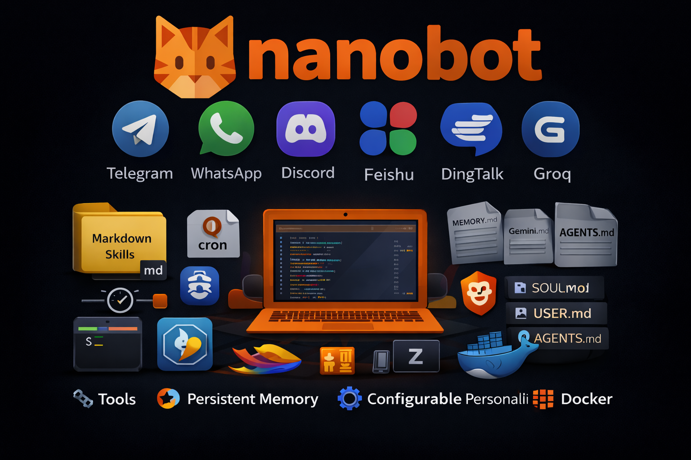

<div align="center">
  
  <h1>nanobot: Ultra-Lightweight Personal AI Assistant</h1>
  <p>
    <a href="https://pypi.org/project/nanobot-ai/"></a>
    <a href="https://pepy.tech/project/nanobot-ai"></a>
    
    
    <a href="./COMMUNICATION.md"></a>
    <a href="./COMMUNICATION.md"></a>
    <a href="https://discord.gg/MnCvHqpUGB"></a>
  </p>
</div>

🐈 **nanobot** is an **ultra-lightweight** personal AI assistant inspired by [Clawdbot](https://github.com/openclaw/openclaw) 

⚡️ Delivers core agent functionality in just **~4,000** lines of code — **99% smaller** than Clawdbot's 430k+ lines.

📏 Real-time line count: **3,437 lines** (run `bash core_agent_lines.sh` to verify anytime)

## 📢 News

- **2026-02-08** 🔧 Refactored Providers—adding a new LLM provider now takes just 2 simple steps! Check [here](#providers).
- **2026-02-07** 🚀 Released v0.1.3.post5 with Qwen support & several key improvements! Check [here](https://github.com/HKUDS/nanobot/releases/tag/v0.1.3.post5) for details.
- **2026-02-06** ✨ Added Moonshot/Kimi provider, Discord integration, and enhanced security hardening!
- **2026-02-05** ✨ Added Feishu channel, DeepSeek provider, and enhanced scheduled tasks support!
- **2026-02-04** 🚀 Released v0.1.3.post4 with multi-provider & Docker support! Check [here](https://github.com/HKUDS/nanobot/releases/tag/v0.1.3.post4) for details.
- **2026-02-03** ⚡ Integrated vLLM for local LLM support and improved natural language task scheduling!
- **2026-02-02** 🎉 nanobot officially launched! Welcome to try 🐈 nanobot!

## Key Features of nanobot:

🪶 **Ultra-Lightweight**: Just ~4,000 lines of core agent code — 99% smaller than Clawdbot.

🔬 **Research-Ready**: Clean, readable code that's easy to understand, modify, and extend for research.

⚡️ **Lightning Fast**: Minimal footprint means faster startup, lower resource usage, and quicker iterations.

💎 **Easy-to-Use**: One-click to deploy and you're ready to go.

## 🏗️ Architecture

<p align="center">
  
</p>

## ✨ Features

<table align="center">
  <tr align="center">
    <th><p align="center">📈 24/7 Real-Time Market Analysis</p></th>
    <th><p align="center">🚀 Full-Stack Software Engineer</p></th>
    <th><p align="center">📅 Smart Daily Routine Manager</p></th>
    <th><p align="center">📚 Personal Knowledge Assistant</p></th>
  </tr>
  <tr>
    <td align="center"><p align="center"></p></td>
    <td align="center"><p align="center"></p></td>
    <td align="center"><p align="center"></p></td>
    <td align="center"><p align="center"></p></td>
  </tr>
  <tr>
    <td align="center">Discovery • Insights • Trends</td>
    <td align="center">Develop • Deploy • Scale</td>
    <td align="center">Schedule • Automate • Organize</td>
    <td align="center">Learn • Memory • Reasoning</td>
  </tr>
</table>

## 📦 Install

Escolha entre **VPS direto** ou **Docker**. Ambos usam o mesmo repositório.

### Opção A: VPS Direto (recomendado)

**1. Atualizar o sistema e instalar ferramentas:**

```bash
apt update && apt upgrade -y
apt install -y python3 python3-venv python3-pip git
```

- `python3` — linguagem que o nanobot usa
- `python3-venv` — permite criar ambientes virtuais (o Ubuntu 24.04 não traz por padrão)
- `git` — para baixar o código do GitHub

**2. Clonar o repositório:**

```bash
cd /root
git clone https://github.com/inematds/nanobot.git
cd nanobot
```

**3. Criar o ambiente virtual (venv):**

```bash
python3 -m venv venv
```

O venv é uma cópia isolada do Python. Ele funciona como uma "caixa" onde as dependências
do nanobot ficam separadas do sistema. Sem isso, instalar pacotes pode quebrar o Ubuntu.

**4. Ativar o venv:**

```bash
source venv/bin/activate
```

O prompt muda para `(venv) root@servidor:~/nanobot#` indicando que está ativo.

> [!IMPORTANT]
> **O que é o `source`?** Quando você roda um script normal (`./start.sh`), ele abre
> um terminal temporário, executa lá dentro, e fecha — as mudanças morrem junto.
> Com `source`, os comandos rodam **no seu terminal atual**, então o venv fica ativo pra você usar.
> Toda vez que abrir um novo terminal SSH, precisa rodar `source` de novo (ou usar o atalho `nb`).

**5. Instalar o nanobot e dependências:**

```bash
pip install -e .
```

O `pip` lê o `pyproject.toml` e instala tudo que o nanobot precisa (~50 pacotes) dentro do venv.
O `-e` significa "editável" — se fizer `git pull` depois, as mudanças valem sem reinstalar.

**Resumo em uma linha:**

```bash
apt install -y python3 python3-venv git && cd /root && git clone https://github.com/inematds/nanobot.git && cd nanobot && python3 -m venv venv && source venv/bin/activate && pip install -e .
```

### Opção B: Docker

```bash
# 1. Clonar o repositório
git clone https://github.com/inematds/nanobot.git
cd nanobot

# 2. Subir com docker compose
docker compose up -d
```

Pronto. O container roda em background com volume persistente.

### Outras formas de instalar

```bash
# Via uv (rápido)
uv tool install nanobot-ai

# Via PyPI
pip install nanobot-ai
```

## 🚀 Quick Start

### Passo 1: Inicializar

```bash
# VPS direto (com venv ativo)
nanobot onboard

# Docker
docker compose exec nanobot nanobot onboard
```

Isso cria a pasta `~/.nanobot/` com a configuração padrão e o workspace do agente.

### Passo 2: Configurar atalhos (opcional, recomendado)

```bash
echo '' >> ~/.bashrc
echo '# Nanobot - atalhos' >> ~/.bashrc
echo 'alias nb="cd /root/nanobot && source venv/bin/activate"' >> ~/.bashrc
echo 'alias nbhelp="cd /root/nanobot && bash help.sh"' >> ~/.bashrc
source ~/.bashrc
```

Isso cria dois atalhos que funcionam toda vez que você entrar via SSH:

| Atalho | O que faz |
|--------|-----------|
| `nb` | Ativa o ambiente do nanobot (mesmo que `cd /root/nanobot && source venv/bin/activate`) |
| `nbhelp` | Mostra um guia rápido com todos os comandos |

> [!TIP]
> **O que é o `.bashrc`?** É um arquivo que o Linux lê automaticamente toda vez que
> você abre um terminal ou entra via SSH. É como uma "lista de preparação automática".
>
> **O que é um `alias`?** É um apelido para um comando longo. Em vez de digitar
> `cd /root/nanobot && source venv/bin/activate`, você digita só `nb`.
> Funciona como o contato do celular — em vez de decorar o número, salva com um nome.

Também existem dois scripts na raiz do projeto:

| Script | Como usar | O que faz |
|--------|-----------|-----------|
| `start.sh` | `source start.sh` | Ativa o venv (precisa do `source`) |
| `help.sh` | `bash help.sh` | Mostra guia rápido com todos os comandos |

### Passo 3: Configurar a API Key

> [!CAUTION]
> **Cuidado com os diretórios!** O nanobot usa **dois diretórios diferentes**:
>
> | Diretório | O que é | Exemplo |
> |-----------|---------|---------|
> | `~/nanobot/` | **Código fonte** (repositório git) | `~/nanobot/nanobot/`, `~/nanobot/README.md` |
> | `~/.nanobot/` | **Dados e configuração** (pasta oculta) | `~/.nanobot/config.json`, `~/.nanobot/workspace/` |
>
> O arquivo de configuração fica em **`~/.nanobot/config.json`** (com ponto!).
> Se você editar `~/nanobot/config.json` (sem ponto), o nanobot **não vai encontrar**.

```bash
# Criar o diretório de dados (se não existir)
mkdir -p ~/.nanobot

# Copiar o exemplo como ponto de partida
cp ~/nanobot/config.example.json ~/.nanobot/config.json

# Editar e colocar sua API key
nano ~/.nanobot/config.json
```

> [!TIP]
> **Onde conseguir API keys:**
> - [OpenRouter](https://openrouter.ai/keys) — acesso a todos os modelos (recomendado)
> - [Anthropic](https://console.anthropic.com) — Claude direto
> - [OpenAI](https://platform.openai.com) — GPT direto
> - [DeepSeek](https://platform.deepseek.com) — DeepSeek direto
> - [Brave Search](https://brave.com/search/api/) — busca web (opcional)

**Exemplo mínimo com OpenRouter + Telegram** (recomendado):
```json
{
  "providers": {
    "openrouter": {
      "apiKey": "sk-or-v1-COLE_SUA_CHAVE_AQUI"
    }
  },
  "agents": {
    "defaults": {
      "model": "qwen/qwen3-coder-next"
    }
  },
  "channels": {
    "telegram": {
      "enabled": true,
      "token": "SEU_TOKEN_DO_BOTFATHER",
      "allowFrom": ["SEU_ID_NUMERICO"]
    }
  }
}
```

**Exemplo mínimo com Anthropic direto + Telegram:**
```json
{
  "providers": {
    "anthropic": {
      "apiKey": "sk-ant-COLE_SUA_CHAVE_AQUI"
    }
  },
  "agents": {
    "defaults": {
      "model": "anthropic/claude-sonnet-4-5-20250929"
    }
  },
  "channels": {
    "telegram": {
      "enabled": true,
      "token": "SEU_TOKEN_DO_BOTFATHER",
      "allowFrom": ["SEU_ID_NUMERICO"]
    }
  }
}
```

> [!WARNING]
> **O nome do modelo depende do provider!** Cada provider usa seu próprio formato:
>
> | Provider | Formato do modelo | Exemplo |
> |----------|-------------------|---------|
> | OpenRouter | Slug do OpenRouter | `anthropic/claude-sonnet-4.5` |
> | Anthropic direto | ID oficial Anthropic | `anthropic/claude-sonnet-4-5-20250929` |
> | OpenAI | ID oficial OpenAI | `openai/gpt-4o` |
> | DeepSeek | ID DeepSeek | `deepseek/deepseek-chat` |
>
> Consulte a página do modelo no seu provider para o nome exato.

> [!IMPORTANT]
> Depois de salvar, proteja o arquivo: `chmod 600 ~/.nanobot/config.json`

**Verificar se o config foi carregado corretamente:**
```bash
nanobot status
```
Todos os providers com API key devem aparecer com **✓**. Se aparecer "not set", verifique se editou o arquivo correto (`~/.nanobot/config.json`).

### Passo 4: Testar

```bash
nanobot agent -m "What is 2+2?"
```

### Passo 5: Rodar o Gateway (modo servidor)

```bash
# VPS direto (roda em foreground, Ctrl+C para parar)
nanobot gateway

# VPS direto (roda em background, sobrevive ao fechar o terminal)
nohup python -m nanobot gateway > ~/.nanobot/gateway.log 2>&1 &

# Docker (já está rodando se usou docker compose up -d)
docker compose logs -f nanobot
```

### Passo 6: Verificar segurança

```bash
nanobot security-check
```

That's it! You have a working AI assistant.

## 🔧 Uso no Dia a Dia

Toda vez que entrar via SSH, primeiro ative o ambiente:

```bash
# Opção 1: atalho (se configurou no passo 2)
nb

# Opção 2: usando o script
cd /root/nanobot
source start.sh

# Opção 3: comando completo
cd /root/nanobot && source venv/bin/activate
```

### Comandos rápidos

| O que quer fazer          | Comando |
|---------------------------|---------|
| Ver configuração          | `nanobot status` |
| Ver se está rodando       | `ps aux \| grep 'nanobot gateway'` |
| Iniciar (foreground)      | `nanobot gateway` |
| Iniciar (background)      | `nohup python -m nanobot gateway > ~/.nanobot/gateway.log 2>&1 &` |
| Parar                     | `pkill -f 'nanobot gateway'` |
| Reiniciar                 | `pkill -f 'nanobot gateway' && sleep 2 && nohup python -m nanobot gateway > ~/.nanobot/gateway.log 2>&1 &` |
| Ver log ao vivo           | `tail -f ~/.nanobot/gateway.log` |
| Ver guia rápido           | `bash help.sh` |

### Atualizar o código

```bash
nb
git pull && pip install -e .
pkill -f 'nanobot gateway'
nohup python -m nanobot gateway > ~/.nanobot/gateway.log 2>&1 &
```

## ❓ Troubleshooting

<details>
<summary><b>"Error: No API key configured"</b></summary>

**Causa mais comum:** config no diretório errado.

```bash
# Verificar se o config está no lugar certo
cat ~/.nanobot/config.json

# Se mostrar keys vazias ou arquivo não encontrado:
cp ~/nanobot/config.example.json ~/.nanobot/config.json
nano ~/.nanobot/config.json   # Adicionar sua API key
```

Lembre: `~/.nanobot/` (com ponto) ≠ `~/nanobot/` (sem ponto).

</details>

<details>
<summary><b>"pip: command not found" ou erro ao instalar</b></summary>

Use ambiente virtual (venv) em vez de pip global:

```bash
apt update && apt install -y python3 python3-venv
python3 -m venv venv
source venv/bin/activate
pip install -e .
```

</details>

<details>
<summary><b>nanobot status mostra providers "not set" mesmo com key configurada</b></summary>

1. Verifique se editou `~/.nanobot/config.json` (com ponto)
2. Verifique se o JSON é válido: `python3 -c "import json; json.load(open('/root/.nanobot/config.json')); print('OK')"`
3. Verifique se a key está no campo correto (ex: `providers.openrouter.apiKey`)
4. Rode `python3 diagnose.py` na pasta do projeto para diagnóstico detalhado

</details>

<details>
<summary><b>Modelo não encontrado / erro de modelo</b></summary>

Cada provider usa nomes diferentes. Verifique o nome exato na página do provider:

- **OpenRouter:** vá em [openrouter.ai/models](https://openrouter.ai/models), copie o ID do modelo (ex: `anthropic/claude-sonnet-4.5`)
- **Anthropic direto:** use o ID oficial (ex: `anthropic/claude-sonnet-4-5-20250929`)
- **OpenAI:** use o ID oficial (ex: `openai/gpt-4o`)

</details>

<details>
<summary><b>Git clone dá "Permission denied"</b></summary>

O repositório é público. Use HTTPS (não SSH):

```bash
git clone https://github.com/inematds/nanobot.git
```

SSH só funciona se você tiver uma chave SSH configurada no GitHub.

</details>

## 🖥️ Local Models (vLLM)

Run nanobot with your own local models using vLLM or any OpenAI-compatible server.

**1. Start your vLLM server**

```bash
vllm serve meta-llama/Llama-3.1-8B-Instruct --port 8000
```

**2. Configure** (`~/.nanobot/config.json`)

```json
{
  "providers": {
    "vllm": {
      "apiKey": "dummy",
      "apiBase": "http://localhost:8000/v1"
    }
  },
  "agents": {
    "defaults": {
      "model": "meta-llama/Llama-3.1-8B-Instruct"
    }
  }
}
```

**3. Chat**

```bash
nanobot agent -m "Hello from my local LLM!"
```

> [!TIP]
> The `apiKey` can be any non-empty string for local servers that don't require authentication.

## 💬 Chat Apps

Talk to your nanobot through Telegram, Discord, WhatsApp, or Feishu — anytime, anywhere.

<p align="center">
  
</p>

| Channel | Setup |
|---------|-------|
| **Telegram** | Easy (just a token) |
| **Discord** | Easy (bot token + intents) |
| **WhatsApp** | Medium (scan QR) |
| **Feishu** | Medium (app credentials) |

<details>
<summary><b>Telegram</b> (Recommended)</summary>

**1. Criar o bot**
- Abra o Telegram e busque `@BotFather`
- Envie `/newbot` e siga as instruções (escolha nome e username)
- O BotFather vai te dar um **token** como: `123456789:ABCdefGHIjklMNOpqrsTUVwxyz`
- Copie esse token

**2. Descobrir seu User ID**
- Busque `@userinfobot` no Telegram
- Envie qualquer mensagem para ele
- Ele responde com seu **ID numérico** (ex: `987654321`)

**3. Configurar**

Edite `~/.nanobot/config.json` e adicione/atualize a seção `channels`:

```json
{
  "providers": {
    "openrouter": {
      "apiKey": "sk-or-v1-SUA_KEY"
    }
  },
  "agents": {
    "defaults": {
      "model": "anthropic/claude-sonnet-4.5"
    }
  },
  "channels": {
    "telegram": {
      "enabled": true,
      "token": "123456789:ABCdefGHIjklMNOpqrsTUVwxyz",
      "allowFrom": ["987654321"]
    }
  }
}
```

> [!WARNING]
> O `allowFrom` é **obrigatório** por segurança. Se deixar vazio `[]`, **ninguém** consegue usar o bot.
> Coloque seu User ID numérico como string entre aspas.

**4. Rodar**

```bash
nanobot gateway
```

O bot vai ficar online no Telegram. Envie uma mensagem para ele para testar.

</details>

<details>
<summary><b>Discord</b></summary>

**1. Create a bot**
- Go to https://discord.com/developers/applications
- Create an application → Bot → Add Bot
- Copy the bot token

**2. Enable intents**
- In the Bot settings, enable **MESSAGE CONTENT INTENT**
- (Optional) Enable **SERVER MEMBERS INTENT** if you plan to use allow lists based on member data

**3. Get your User ID**
- Discord Settings → Advanced → enable **Developer Mode**
- Right-click your avatar → **Copy User ID**

**4. Configure**

```json
{
  "channels": {
    "discord": {
      "enabled": true,
      "token": "YOUR_BOT_TOKEN",
      "allowFrom": ["YOUR_USER_ID"]
    }
  }
}
```

**5. Invite the bot**
- OAuth2 → URL Generator
- Scopes: `bot`
- Bot Permissions: `Send Messages`, `Read Message History`
- Open the generated invite URL and add the bot to your server

**6. Run**

```bash
nanobot gateway
```

</details>

<details>
<summary><b>WhatsApp</b></summary>

Requer **Node.js ≥18** instalado no servidor.

**1. Instalar Node.js (se não tiver)**

```bash
curl -fsSL https://deb.nodesource.com/setup_20.x | bash -
apt install -y nodejs
```

**2. Compilar a bridge do WhatsApp**

```bash
cd ~/nanobot/bridge
npm install && npm run build
cd ~/nanobot
```

**3. Vincular dispositivo**

```bash
nanobot channels login
```

Um QR code vai aparecer no terminal. No celular:
- Abra o WhatsApp → **Configurações** → **Dispositivos vinculados** → **Vincular dispositivo**
- Escaneie o QR code

**4. Configurar**

Edite `~/.nanobot/config.json` e adicione a seção WhatsApp:

```json
{
  "providers": {
    "openrouter": {
      "apiKey": "sk-or-v1-SUA_KEY"
    }
  },
  "agents": {
    "defaults": {
      "model": "anthropic/claude-sonnet-4.5"
    }
  },
  "channels": {
    "whatsapp": {
      "enabled": true,
      "allowFrom": ["+5511999998888"]
    }
  }
}
```

> [!WARNING]
> O `allowFrom` usa o número no formato internacional com `+` (ex: `+5511999998888`).
> Se deixar vazio `[]`, **ninguém** consegue usar o bot.

**5. Rodar** (dois terminais)

```bash
# Terminal 1 — manter a bridge rodando
nanobot channels login

# Terminal 2 — rodar o gateway
nanobot gateway
```

Envie uma mensagem para o número vinculado para testar.

</details>

<details>
<summary><b>Feishu (飞书)</b></summary>

Uses **WebSocket** long connection — no public IP required.

**1. Create a Feishu bot**
- Visit [Feishu Open Platform](https://open.feishu.cn/app)
- Create a new app → Enable **Bot** capability
- **Permissions**: Add `im:message` (send messages)
- **Events**: Add `im.message.receive_v1` (receive messages)
  - Select **Long Connection** mode (requires running nanobot first to establish connection)
- Get **App ID** and **App Secret** from "Credentials & Basic Info"
- Publish the app

**2. Configure**

```json
{
  "channels": {
    "feishu": {
      "enabled": true,
      "appId": "cli_xxx",
      "appSecret": "xxx",
      "encryptKey": "",
      "verificationToken": "",
      "allowFrom": []
    }
  }
}
```

> `encryptKey` and `verificationToken` are optional for Long Connection mode.
> `allowFrom`: Leave empty to allow all users, or add `["ou_xxx"]` to restrict access.

**3. Run**

```bash
nanobot gateway
```

> [!TIP]
> Feishu uses WebSocket to receive messages — no webhook or public IP needed!

</details>

<details>
<summary><b>DingTalk (钉钉)</b></summary>

Uses **Stream Mode** — no public IP required.

**1. Create a DingTalk bot**
- Visit [DingTalk Open Platform](https://open-dev.dingtalk.com/)
- Create a new app -> Add **Robot** capability
- **Configuration**:
  - Toggle **Stream Mode** ON
- **Permissions**: Add necessary permissions for sending messages
- Get **AppKey** (Client ID) and **AppSecret** (Client Secret) from "Credentials"
- Publish the app

**2. Configure**

```json
{
  "channels": {
    "dingtalk": {
      "enabled": true,
      "clientId": "YOUR_APP_KEY",
      "clientSecret": "YOUR_APP_SECRET",
      "allowFrom": []
    }
  }
}
```

> `allowFrom`: Leave empty to allow all users, or add `["staffId"]` to restrict access.

**3. Run**

```bash
nanobot gateway
```

</details>

## ⚙️ Configuration

Config file: `~/.nanobot/config.json`

### Providers

> [!NOTE]
> Groq provides free voice transcription via Whisper. If configured, Telegram voice messages will be automatically transcribed.

| Provider | Purpose | Get API Key |
|----------|---------|-------------|
| `openrouter` | LLM (recommended, access to all models) | [openrouter.ai](https://openrouter.ai) |
| `anthropic` | LLM (Claude direct) | [console.anthropic.com](https://console.anthropic.com) |
| `openai` | LLM (GPT direct) | [platform.openai.com](https://platform.openai.com) |
| `deepseek` | LLM (DeepSeek direct) | [platform.deepseek.com](https://platform.deepseek.com) |
| `groq` | LLM + **Voice transcription** (Whisper) | [console.groq.com](https://console.groq.com) |
| `gemini` | LLM (Gemini direct) | [aistudio.google.com](https://aistudio.google.com) |
| `aihubmix` | LLM (API gateway, access to all models) | [aihubmix.com](https://aihubmix.com) |
| `dashscope` | LLM (Qwen) | [dashscope.console.aliyun.com](https://dashscope.console.aliyun.com) |
| `moonshot` | LLM (Moonshot/Kimi) | [platform.moonshot.cn](https://platform.moonshot.cn) |
| `zhipu` | LLM (Zhipu GLM) | [open.bigmodel.cn](https://open.bigmodel.cn) |
| `vllm` | LLM (local, any OpenAI-compatible server) | — |

<details>
<summary><b>Adding a New Provider (Developer Guide)</b></summary>

nanobot uses a **Provider Registry** (`nanobot/providers/registry.py`) as the single source of truth.
Adding a new provider only takes **2 steps** — no if-elif chains to touch.

**Step 1.** Add a `ProviderSpec` entry to `PROVIDERS` in `nanobot/providers/registry.py`:

```python
ProviderSpec(
    name="myprovider",                   # config field name
    keywords=("myprovider", "mymodel"),  # model-name keywords for auto-matching
    env_key="MYPROVIDER_API_KEY",        # env var for LiteLLM
    display_name="My Provider",          # shown in `nanobot status`
    litellm_prefix="myprovider",         # auto-prefix: model → myprovider/model
    skip_prefixes=("myprovider/",),      # don't double-prefix
)
```

**Step 2.** Add a field to `ProvidersConfig` in `nanobot/config/schema.py`:

```python
class ProvidersConfig(BaseModel):
    ...
    myprovider: ProviderConfig = ProviderConfig()
```

That's it! Environment variables, model prefixing, config matching, and `nanobot status` display will all work automatically.

**Common `ProviderSpec` options:**

| Field | Description | Example |
|-------|-------------|---------|
| `litellm_prefix` | Auto-prefix model names for LiteLLM | `"dashscope"` → `dashscope/qwen-max` |
| `skip_prefixes` | Don't prefix if model already starts with these | `("dashscope/", "openrouter/")` |
| `env_extras` | Additional env vars to set | `(("ZHIPUAI_API_KEY", "{api_key}"),)` |
| `model_overrides` | Per-model parameter overrides | `(("kimi-k2.5", {"temperature": 1.0}),)` |
| `is_gateway` | Can route any model (like OpenRouter) | `True` |
| `detect_by_key_prefix` | Detect gateway by API key prefix | `"sk-or-"` |
| `detect_by_base_keyword` | Detect gateway by API base URL | `"openrouter"` |
| `strip_model_prefix` | Strip existing prefix before re-prefixing | `True` (for AiHubMix) |

</details>


### Security

> [!IMPORTANT]
> **Breaking changes:** `restrictToWorkspace` agora é `true` por padrão, `allowFrom` vazio agora **nega todos**, e o gateway escuta em `127.0.0.1`. Veja [SECURITY.md](./SECURITY.md) para detalhes.

| Option | Default | Description |
|--------|---------|-------------|
| `tools.restrictToWorkspace` | `true` | Restringe todos os tools ao diretório workspace. Previne path traversal. |
| `channels.*.allowFrom` | `[]` (deny all) | Lista de IDs permitidos. Vazio = nega todos (fail-secure). Adicione IDs para liberar. |
| `gateway.host` | `127.0.0.1` | Endereço de bind. Use reverse proxy para acesso remoto. |

```bash
# Verificar configuração de segurança
nanobot security-check
```


## CLI Reference

| Command | Description |
|---------|-------------|
| `nanobot onboard` | Initialize config & workspace |
| `nanobot agent -m "..."` | Chat with the agent |
| `nanobot agent` | Interactive chat mode |
| `nanobot gateway` | Start the gateway |
| `nanobot status` | Show status |
| `nanobot channels login` | Link WhatsApp (scan QR) |
| `nanobot channels status` | Show channel status |
| `nanobot security-check` | Verify security configuration |

<details>
<summary><b>Scheduled Tasks (Cron)</b></summary>

```bash
# Add a job
nanobot cron add --name "daily" --message "Good morning!" --cron "0 9 * * *"
nanobot cron add --name "hourly" --message "Check status" --every 3600

# List jobs
nanobot cron list

# Remove a job
nanobot cron remove <job_id>
```

</details>

## 🐳 Docker

O `docker-compose.yml` inclui volume persistente, limites de recursos, e roda como usuário non-root.

```bash
# Subir (build + run em background)
docker compose up -d

# Ver logs
docker compose logs -f

# Inicializar config (primeira vez)
docker compose exec nanobot nanobot onboard

# Editar config no host para adicionar API key
# O volume fica em: docker volume inspect nanobot_nanobot-data
# Ou copie o config para dentro:
docker compose cp ~/.nanobot/config.json nanobot:/home/nanobot/.nanobot/config.json

# Reiniciar após alterar config
docker compose restart

# Testar um comando
docker compose exec nanobot nanobot agent -m "Hello!"

# Verificar status
docker compose exec nanobot nanobot status

# Parar
docker compose down
```

**Sem docker compose** (manual):

```bash
docker build -t nanobot .
docker run -v ~/.nanobot:/home/nanobot/.nanobot -p 127.0.0.1:18790:18790 --restart unless-stopped -d nanobot gateway
```

## 📁 Project Structure

```
/root/
├── nanobot/                    ← CÓDIGO (git clone)
│   ├── nanobot/                ← Código-fonte do bot
│   │   ├── agent/              #   🧠 Core agent logic (loop, context, memory, tools)
│   │   ├── channels/           #   📱 Telegram, Discord, WhatsApp, Feishu, DingTalk
│   │   ├── providers/          #   🤖 LLM providers (OpenRouter, Anthropic, etc.)
│   │   ├── bus/                #   🚌 Message routing
│   │   ├── cron/               #   ⏰ Scheduled tasks
│   │   ├── heartbeat/          #   💓 Proactive wake-up
│   │   ├── session/            #   💬 Conversation sessions
│   │   ├── config/             #   ⚙️ Configuration
│   │   └── cli/                #   🖥️ Commands
│   ├── bridge/                 ← Bridge WhatsApp (Node.js)
│   ├── doc/                    ← Documentação
│   │   └── GUIA_INSTALACAO.md  #   Guia completo para leigos
│   ├── venv/                   ← Ambiente virtual Python (criado na instalação)
│   ├── start.sh                ← Script: ativa o venv (usar com source)
│   ├── help.sh                 ← Script: mostra guia rápido de comandos
│   ├── pyproject.toml          ← Dependências do projeto
│   └── config.example.json     ← Exemplo de configuração
│
└── .nanobot/                   ← DADOS DE RUNTIME (criado pelo onboard)
    ├── config.json             ← Configuração real (chaves, modelo, canais)
    ├── gateway.log             ← Log do servidor
    ├── sessions/               ← Histórico de conversas
    ├── cron/                   ← Tarefas agendadas
    └── workspace/              ← Personalidade do agente (SOUL.md, AGENTS.md)
```

> [!CAUTION]
> Existem **DOIS** diretórios parecidos. O nanobot lê a configuração de `~/.nanobot/config.json`
> (com ponto). O arquivo `~/nanobot/config.example.json` (sem ponto) é apenas um exemplo.

## 🤝 Contribute & Roadmap

PRs welcome! The codebase is intentionally small and readable. 🤗

**Roadmap** — Pick an item and [open a PR](https://github.com/HKUDS/nanobot/pulls)!

- [x] **Voice Transcription** — Support for Groq Whisper (Issue #13)
- [ ] **Multi-modal** — See and hear (images, voice, video)
- [ ] **Long-term memory** — Never forget important context
- [ ] **Better reasoning** — Multi-step planning and reflection
- [ ] **More integrations** — Discord, Slack, email, calendar
- [ ] **Self-improvement** — Learn from feedback and mistakes

### Contributors

<a href="https://github.com/HKUDS/nanobot/graphs/contributors">
  
</a>


## ⭐ Star History

<div align="center">
  <a href="https://star-history.com/#HKUDS/nanobot&Date">
    <picture>
      <source media="(prefers-color-scheme: dark)" srcset="https://api.star-history.com/svg?repos=HKUDS/nanobot&type=Date&theme=dark" />
      <source media="(prefers-color-scheme: light)" srcset="https://api.star-history.com/svg?repos=HKUDS/nanobot&type=Date" />
      
    </picture>
  </a>
</div>

<p align="center">
  <em> Thanks for visiting ✨ nanobot!</em><br><br>
  
</p>


<p align="center">
  <sub>nanobot is for educational, research, and technical exchange purposes only</sub>
</p>
